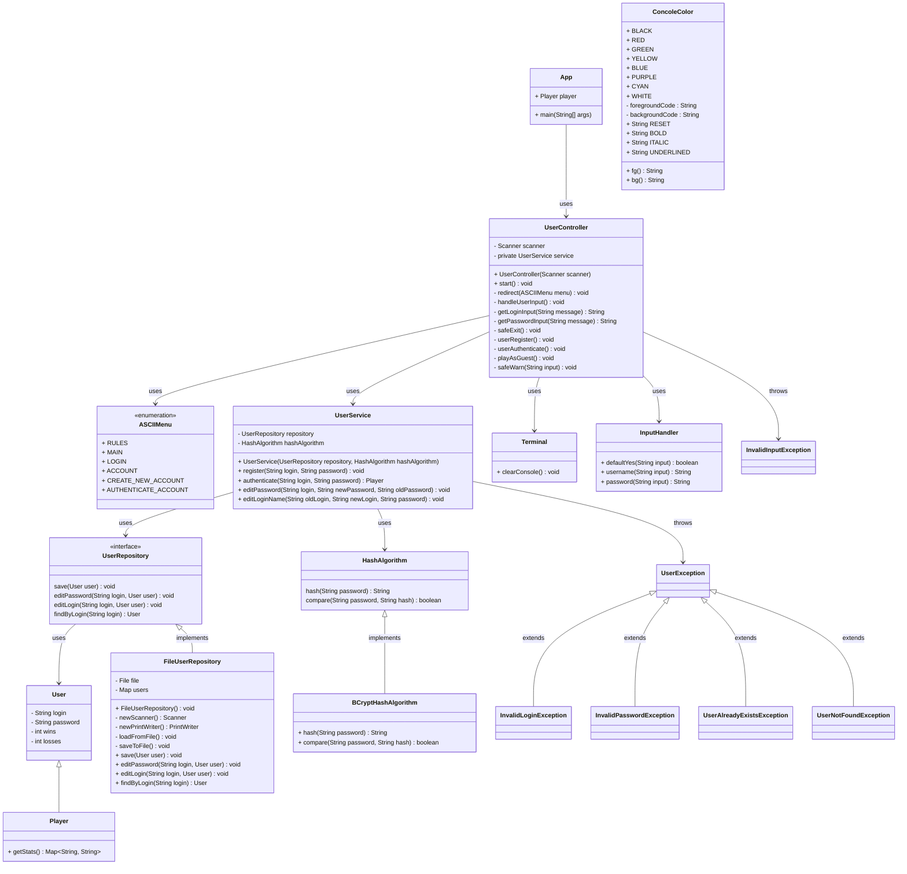

# Register and Authentication UML Class Diagram

```mermaid
classDiagram
    
    %% entry
    class App {
        + Player player
        + main(String[] args)
    }
    
    %% entity models    
    class User {
        - String login
        - String password
        - int wins
        - int losses
    }
    
    class Player {
        + getStats() Map~String, String~
    }
    
    %% interfaces
    class UserRepository {
        <<interface>>
        save(User user) void
        editPassword(String login, User user) void
        editLogin(String login, User user) void
        findByLogin(String login) User
    }
    
    class HashAlgorithm {
        hash(String password) String
        compare(String password, String hash) boolean
    }

    %% enums
    class ASCIIMenu {
        <<enumeration>>
        + RULES
        + MAIN
        + LOGIN
        + ACCOUNT
        + CREATE_NEW_ACCOUNT
        + AUTHENTICATE_ACCOUNT
    }
    
    class ConcoleColor {
        + BLACK
        + RED
        + GREEN
        + YELLOW
        + BLUE
        + PURPLE
        + CYAN
        + WHITE

        - foregroundCode : String
        - backgroundCode : String
        + String RESET
        + String BOLD
        + String ITALIC
        + String UNDERLINED
        
        + fg() String
        + bg() String
    }
    
    %% implementation classes
    class FileUserRepository {
        - File file
        - Map users
        
        + FileUserRepository() void
        - newScanner() Scanner
        - newPrintWriter() PrintWriter
        - loadFromFile() void
        - saveToFile() void
        + save(User user) void
        + editPassword(String login, User user) void
        + editLogin(String login, User user) void
        + findByLogin(String login) User
    }
    
    class BCryptHashAlgorithm {
        + hash(String password) String
        + compare(String password, String hash) boolean
    }
    
    %% services
    class UserService {
        - UserRepository repository
        - HashAlgorithm hashAlgorithm
        
        + UserService(UserRepository repository, HashAlgorithm hashAlgorithm)
        + register(String login, String password) void
        + authenticate(String login, String password) Player
        + editPassword(String login, String newPassword, String oldPassword) void
        + editLoginName(String oldLogin, String newLogin, String password) void
    }
    
    %% controllers
    class UserController {
        - Scanner scanner
        - private UserService service
        
        + UserController(Scanner scanner)
        + start() void
        - redirect(ASCIIMenu menu) void
        - handleUserInput() void
        - getLoginInput(String message) String
        - getPasswordInput(String message) String
        - safeExit() void
        - userRegister() void
        - userAuthenticate() void
        - playAsGuest() void
        - safeWarn(String input) void
    }
    
    %% utils
    class Terminal {
        + clearConsole() void
    }
    
    class InputHandler {
        + defaultYes(String input) boolean
        + username(String input) String
        + password(String input) String
    }
    
    %% exceptions
    class UserException
    class InvalidLoginException
    class InvalidPasswordException
    class UserAlreadyExistsException
    class UserNotFoundException
    class InvalidInputException
    
    %% relationships
    
    HashAlgorithm <|-- BCryptHashAlgorithm : implements
    UserRepository <|-- FileUserRepository : implements
    
    UserException <|-- InvalidLoginException : extends
    UserException <|-- InvalidPasswordException : extends
    UserException <|-- UserAlreadyExistsException : extends
    UserException <|-- UserNotFoundException : extends
    
    User <|-- Player

    UserRepository --> User : uses
    
    UserService --> HashAlgorithm : uses
    UserService --> UserRepository : uses

    UserController --> UserService : uses
    UserController --> ASCIIMenu : uses
    UserController --> InputHandler : uses
    UserController --> Terminal : uses
    App --> UserController : uses

    UserController --> InvalidInputException : throws
    UserService --> UserException : throws


```