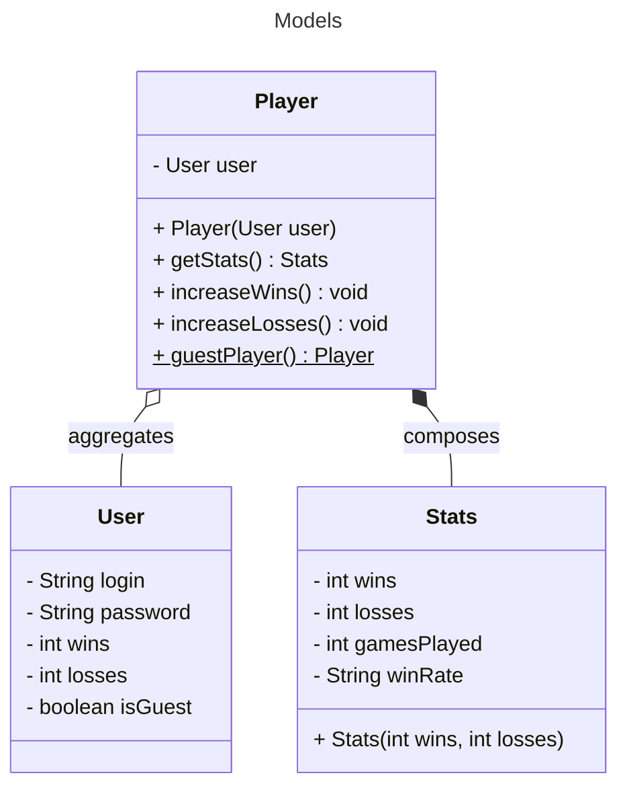
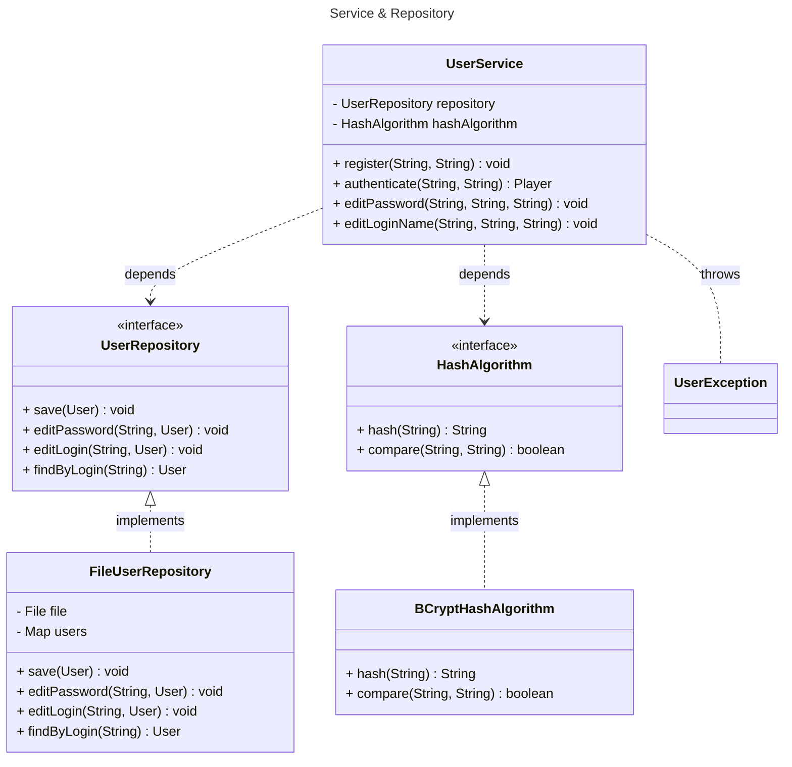
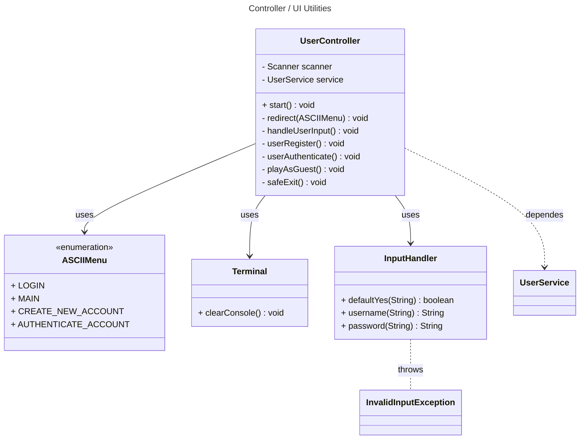
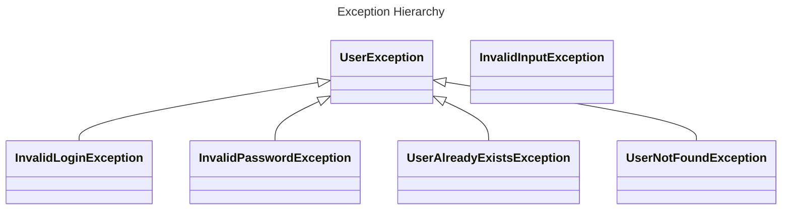
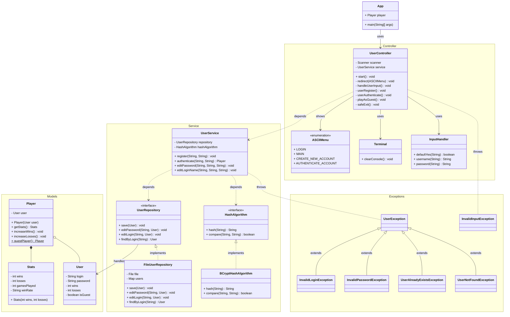

# Register and Authentication UML Class Diagram

## 1. Models Diagram

**Purpose**: Represents the core domain entities (data models) used in user registration and authentication.

* **User**: Contains login info, performance stats (wins/losses), and guest status.
* **Player**: Wraps a User and adds functionality for stats and guest creation.
* **Stats**: Encapsulates win/loss data and computes derived stats like games played and win rate.

### Relationships:
- `Player` _aggregates_ a `User`.
- `Player` _composes_ `Stats`, meaning each player has a unique set of stats.

## 2. Service & Repository Diagram

**Purpose**: Defines the service and data access layers responsible for user management and security.

* **UserRepository (interface)**: Declares methods for user storage and retrieval.
* **FileUserRepository**: Implements `UserRepository` using a file-based system.
* **HashAlgorithm (interface)**: Abstracts password hashing and comparison.
* **BCryptHashAlgorithm**: Concrete implementation using the BCrypt algorithm.
* **UserService**: Contains business logic for registering, authenticating, and editing users.
* **UserException**: Base exception for user-related errors.

### Relationships:
* `UserService` _depends_ on both `UserRepository` and `HashAlgorithm`.
* _Implements_ relationships connect interfaces to their concrete classes.

## 3. Controller / UI Utilities Diagram

**Purpose**: Manages user interaction and coordinates input/output flow.

* **UserController**: Main control class handling UI logic and flow (register, login, guest play).
* **ASCIIMenu**: Enum representing different UI states/screens.
* **Terminal**: Utility to clear the console screen.
* **InputHandler**: Handles validated user input (with exception throwing).
* **InvalidInputException**: Exception thrown for improper input.

### Relationships:
* `UserController` uses `UserService`, `ASCIIMenu`, `Terminal`, and `InputHandler`.

## 4. Exception Hierarchy

**Purpose**: Organizes all custom exceptions used in user management.

* **UserException**: Base class for all user-related exceptions.
  * Includes subclasses for invalid login, password, user existence, and not found errors.
* **InvalidInputException**: Separate branch for handling bad user input during UI interaction.

**Hierarchy**: Clearly structures exceptions for fine-grained error handling across layers.

## Diagrams Relationships
**Purpose**: This final diagram brings together all components of the system—models, services, repositories, UI controllers, and exceptions—into a unified view. It illustrates how different layers interact with each other to support user registration, authentication, and gameplay entry (including guest mode).

* At the core of the system, the User, Player, and Stats models represent the domain data. These are managed by the UserService, which handles business logic and delegates data persistence to the UserRepository (implemented by FileUserRepository) and security tasks to the HashAlgorithm (via BCryptHashAlgorithm).
    
* The UI layer, centered around the UserController, coordinates user interaction using utility classes like InputHandler, ASCIIMenu, and Terminal. It interacts directly with the UserService to process input, execute user actions, and handle flow control.
    
* Custom exceptions like InvalidLoginException and UserAlreadyExistsException propagate through these layers to signal validation and logic failures, supporting a clear and maintainable error-handling mechanism.

This integrated diagram shows the complete architecture and data flow, reflecting how each part contributes to a robust and modular user management system.

